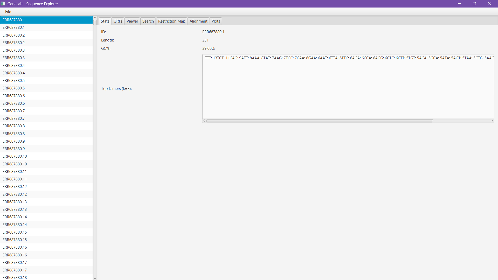
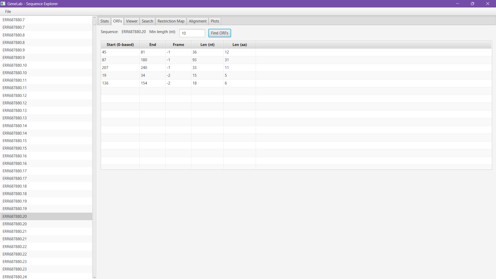

<p align="center">
  
</p>

# 🧬 GeneLab — JavaFX Bioinformatics Toolkit


> **GeneLab** είναι ένα μοντέρνο bioinformatics εργαλείο για visualization και ανάλυση γονιδιακών δεδομένων.  
> Κατασκευασμένο με **JavaFX**, προσφέρει εύκολο και καθαρό περιβάλλον για FASTA/FASTQ parsing, GC%, ORF analysis, και sequence visualization.

---

## 🧠 Features

✅ Φιλικό **GUI** με JavaFX  
✅ Υποστήριξη αρχείων **FASTA / FASTQ**  
✅ Υπολογισμός **Length**, **GC%**, **k-mer counts**  
✅ Ανίχνευση **Open Reading Frames (ORFs)** σε 6 frames  
✅ Οπτικοποίηση ORFs με highlights  
✅ Επεκτάσιμο architecture (Alignment, Plots, Export κ.ά.)  

---

## 🧩 Screenshots

| Stats Tab | ORF Finder |
|------------|------------|
|  |  |

---

## ⚙️ Requirements

| Εξάρτηση | Έκδοση |
|-----------|--------|
| **Java JDK** | 17 ή νεότερη |
| **Maven** | 3.8+ |
| **JavaFX SDK** | Περιλαμβάνεται μέσω Maven |
| *(Προαιρετικό)* **WiX Toolset** | Για δημιουργία Windows `.msi` installer |

---

## 🚀 Run (Development Mode)

```bash
# Clone το project
git clone https://github.com/kselionis/GeneLab.git
cd GeneLab

# Τρέξε μέσω Maven
mvn clean javafx:run
```

---

## 🏗️ Build Executable JAR

```bash
mvn clean package -DskipTests
java -jar target/genelab-0.1.0.jar
```

> Αν εμφανιστεί “JavaFX runtime components are missing”, χρησιμοποίησε:
> ```bash
> mvn javafx:run
> ```

---

## 💾 Δημιουργία MSI Installer (Windows)

Απαραίτητα:
- **WiX Toolset** στο PATH  
- **jpackage** (έρχεται με JDK 17+)

```bash
mvn clean javafx:jlink
jpackage --type msi --name "GeneLab" ^
  --input target ^
  --main-jar genelab-0.1.0.jar ^
  --main-class com.konsel.genelab.GeneLabApp ^
  --icon assets/genelab.ico ^
  --app-version 0.1.0 ^
  --win-menu --win-shortcut ^
  --vendor "Konsel Labs"
```

Το MSI δημιουργείται στο `dist/`.

---

## 📁 Project Structure

```
src/
 ├─ main/java/com/konsel/genelab/
 │   ├─ GeneLabApp.java
 │   ├─ ui/MainView.java
 │   ├─ bio/
 │   │   ├─ StatsService.java
 │   │   ├─ OrfService.java
 │   │   └─ AlignmentService.java
 │   ├─ io/
 │   │   ├─ FastaParser.java
 │   │   └─ FastqParser.java
 │   └─ model/
 │       ├─ SequenceRecord.java
 │       └─ Orf.java
 ├─ main/resources/
 │   ├─ ui/main_view.fxml
 │   ├─ styles.css
 │   └─ assets/genelab.ico
 └─ test/java/... (JUnit 5 tests)
```

---

## 🧪 Run Tests

```bash
mvn test
```

---

## 🧑‍💻 Author

**Konstantinos “Konsel” Selionis**  
📍 Greece  
💼 Computer Science & IT Student 

🔗 [GitHub @kselionis](https://github.com/kselionis)

---

## ⚖️ License

This project is licensed under the **MIT License**.  
See the [LICENSE](LICENSE) file for details.

---

## 🌟 Star History

[](https://star-history.com/#kselionis/GeneLab&Date)

---

<p align="center">
  <i>Made with 💙 by Konsel — for science, code, and creativity.</i>
</p>
